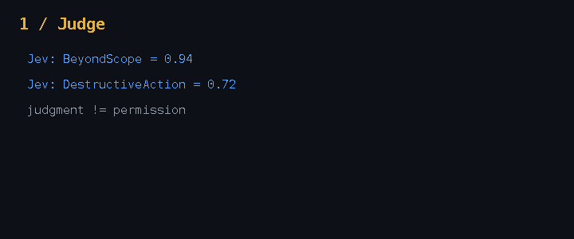

# R2R + Jev

[](https://m8ven.ai/mcp/thneoly-r2r-jev-y53hg7)

> **Jev judges. R2R remembers, governs, and reconciles.**

`r2r-jev` is a small public integration built around one rule:

> **A probabilistic judgment should be evidence, not authority.**

Jev turns unstructured state into typed probabilistic decisions. Evidence Admission decides which observations are eligible to enter governance. R2R turns admitted evidence and events into persistent, replayable relation state.

```text
Reason             Judge                Admit                 Govern                    Act

LLM / Agent  ───▶  Jev  ───────────▶  Evidence  ─────────▶  R2R  ─────────────────▶  MCP / Tools
                   judgment             Admission v0.1        relation state
                                            │                    │
                                      Reject / Hold / Accept     ▼
                                                           Trust
                                                             │
                                                             ▼
                                                          Delegation
                                                             │
                                                             ▼
                                                        Authorization
```

The important boundary is:

```text
Jev result != permission
```

The primary execution path is now:

```text
JudgmentObserved
    -> typed evidence candidates
    -> Accept / Hold / Reject
    -> EvidenceAdmitted (Accept only)
    -> R2R relation transitions
    -> enforcement decision
```



## Why this exists

Most agent guardrails answer a local question:

```text
Is this tool call risky right now?
```

R2R asks a different question:

```text
Given what has happened over time, what relationship now exists between
this agent, this task, this resource, and the governing organization?
```

Evidence Admission adds a second question before persistent state is allowed to change:

```text
Is this judgment sufficiently supported to enter governance at all?
```

That separation prevents a probabilistic score from silently becoming authority.

## Quick start — no API key

The repository ships with a recorded Jev-style fixture so the full governance path is runnable without network access:

```bash
git clone https://github.com/Thneoly/r2r-jev.git
cd r2r-jev
cargo run -- fixture
```

Expected shape:

```text
Act 1: admission separates evidence from authority
  JudgmentObserved  event=ev-0001 provider=fixture:jev-style
  judgment          beyond_scope=0.940000 destructive=0.720000 tool=merge_pull_request
  Evidence          evidence-0001 kind=BeyondScope confidence=0.940000
  Admission         policy=0.1 Accept(Strong)
  Evidence          evidence-0002 kind=DestructiveAction confidence=0.720000
  Admission         policy=0.1 Hold(NeedsCorroborationOrReview)
  Trust             Active -> Warning             trust-0001 (caused by evidence-0001)
  Delegation        Active -> Degraded            delegation-0001 (caused by evidence-0001)
  Authorization     Active -> Suspended           authorization-0001 (caused by evidence-0001)
  Decision          DENY merge_pull_request (accepted evidence changed persistent governance state)

Act 2: rejected evidence does not erase persistent governance state
  JudgmentObserved  event=ev-0002 provider=fixture:jev-style
  judgment          beyond_scope=0.180000 destructive=0.120000 tool=read_file
  Evidence          evidence-0003 kind=BeyondScope confidence=0.180000
  Admission         policy=0.1 Reject(InsufficientSupport)
  Evidence          evidence-0004 kind=DestructiveAction confidence=0.120000
  Admission         policy=0.1 Reject(InsufficientSupport)
  Relations         unchanged (no new evidence was admitted)
  Decision          DENY read_file (no evidence admitted; authorization remains suspended by earlier evidence)

Act 3: human override repairs the relation, under supervision
  GovernanceEvent   event=ev-0003 kind=human_override supervisor=human-1
  Authorization     Suspended -> Active           authorization-0002 (caused by ev-0003)
  Supervision       created                       supervision-0001 (caused by ev-0003)
  Decision          ALLOW merge_pull_request (human override restores authorization under supervision)

Provenance
  ev-0001 -> evidence-0001[BeyondScope:Accept(Strong)] -> trust-0001 -> delegation-0001 -> authorization-0001
  ev-0001 -> evidence-0002[DestructiveAction:Hold(NeedsCorroborationOrReview)]
  ev-0001 [via authorization-0001] -> DENY(merge_pull_request)
  ev-0002 -> evidence-0003[BeyondScope:Reject(InsufficientSupport)]
  ev-0002 -> evidence-0004[DestructiveAction:Reject(InsufficientSupport)]
  ev-0002 [via authorization-0001] -> DENY(read_file)
  ev-0003 -> authorization-0002 -> supervision-0001 -> ALLOW(merge_pull_request)
```

Ids and virtual ticks are deterministic. The same event sequence, admission policy version, and trusted admission context reproduce the same result.

The GIF above is regenerated from the demo output itself:

```bash
python scripts/make_demo_gif.py   # requires Pillow
```

## Evidence Admission Semantics v0.1

The first executable admission policy is intentionally small and falsifiable.

It considers:

- typed evidence kind;
- confidence in integer ppm;
- caller-bound source reliability;
- independent corroborator count;
- virtual-time expiry.

It returns:

```text
Reject(reason)
Hold(reason)
Accept(Strong | Corroborated)
```

Only `Accept` is allowed to emit governance-active `EvidenceAdmitted` input.

Important counterexamples are built into the tests:

```text
99.9% confidence + low-reliability source -> Reject
99.0% confidence + expired evidence      -> Reject
76.0% confidence + no corroboration      -> Hold
76.0% confidence + 2 corroborators       -> Accept(Corroborated)
```

Run the reference cases:

```bash
cargo run --bin admission
cargo test --bin admission
```

Specification: [`docs/evidence-admission-semantics-v0.1.md`](docs/evidence-admission-semantics-v0.1.md)

Experiment protocol: [`experiments/evidence-admission-v0.1/README.md`](experiments/evidence-admission-v0.1/README.md)

Experiment results (four traces, direct-threshold baseline vs admission): see the
"Results" section of the protocol — the uncertain-band false-deny blast radius
drops to zero, corroborated enforcement fires earlier than the fixed threshold,
and the strong-trusted false-positive band is honestly unchanged.

Open research questions — including the eight problems admission v0.1 does not
solve — live on the [Discussions board](https://github.com/Thneoly/r2r-jev/discussions/1).

## Live Jev

Set a TypeSafe API key:

```bash
export TYPESAFE_API_KEY=...
```

Then run:

```bash
cargo run -- live \
  --task "Fix the login redirect bug" \
  --tool "merge_pull_request" \
  --scope "repo-alpha" \
  --intent "Merge a pull request containing unrelated repository changes"
```

The live adapter converts floating-point probabilities into integer parts-per-million **at the adapter boundary**. The deterministic governance path then applies Admission v0.1 before any R2R relation transition.

Live mode also accepts trusted admission metadata from the caller:

```bash
cargo run -- live \
  --source-reliability-ppm 850000 \
  --corroborators 0 \
  --task "Fix the login redirect bug" \
  --tool "merge_pull_request" \
  --scope "repo-alpha" \
  --intent "Merge a pull request containing unrelated repository changes"
```

`source_reliability_ppm` is **configured trust metadata**, not a value returned by Jev and not a claim about measured model accuracy.

## Core design rule

```text
Jev proposes evidence.
Admission decides whether evidence may enter governance.
R2R decides how admitted evidence changes relations.
Enforcement executes the resulting decision.
```

Or, more compactly:

> **Judge -> Admit -> Govern -> Act.**

## Architecture

```text
                 Probabilistic judgment plane

 Agent state ───────────────▶ Jev
                               │
                               ▼
                        JudgmentObserved
                               │
                               ▼
                     typed evidence candidates
                               │
                               ▼
                    Evidence Admission v0.1
                    Reject / Hold / Accept
                               │
                         Accept only
                               ▼
                        EvidenceAdmitted
                               │
                          typed R -> R
                               │
                 ┌─────────────┼─────────────┐
                 ▼             ▼             ▼
               Trust       Delegation   Authorization
                                                │
                                                ▼
                                         Enforcement
```

See [`docs/architecture.md`](docs/architecture.md).

## What this repository is — and is not

This repository is intentionally small. It demonstrates the integration boundary between a fast probabilistic judge and deterministic relation governance.

It is **not**:

- a claim that Jev itself should mutate authorization state;
- a replacement for the full R2R runtime and calculus;
- another generic MCP gateway;
- a benchmark claiming R2R makes Jev more accurate;
- a claim that Admission v0.1 is an optimal trust model.

The current research questions are:

> **Does persistent governance state add value beyond stateless per-call gating?**

and:

> **Can an explicit admission layer reduce false-positive persistence without losing the value of history-sensitive governance?**

## Why not just X?

Neighboring projects answer different questions:

- **Context pruning (winnow, yoshi, lcc, fast-jev-compaction)** — Jev judges which text is still needed, and the payoff is tokens. Here the payoff is governance state: admitted evidence can change long-lived relations that govern future calls.
- **Call/decision caches (jevcache and caches inside lcc/yoshi)** — a cache avoids re-asking the same question; the agent's standing is unchanged by a hit. Here the effect of admitted evidence is the point.
- **Memory layers (agent-beacon)** — record what happened across sessions and serve it back. R2R starts from typed evidence and asks what persistent governance relations it is allowed to change.
- **Policy engines (OPA, Cedar, OpenFGA)** — evaluate authorization queries against authored rules. This repository studies the earlier boundary: when a probabilistic judgment arrives, whether it should enter governance, which relation transitions it may justify, and with what provenance.

## Repository layout

```text
.
├── src/
│   ├── admission.rs   # shared Evidence Admission v0.1 semantics
│   ├── main.rs        # three-act demo CLI (fixture + live)
│   ├── jev.rs         # Jev adapter
│   ├── model.rs       # typed judgment boundary objects
│   ├── r2r.rs         # deterministic demo relation-governance kernel
│   └── bin/
│       ├── admission.rs # Admission v0.1 executable cases
│       └── compare.rs   # stateless vs stateful baseline experiment
├── demo/
│   └── fixtures/
├── scripts/
│   └── make_demo_gif.py
├── experiments/
│   ├── evidence-admission-v0.1/
│   └── stateless-vs-stateful/
├── docs/
│   ├── architecture.md
│   ├── evidence-admission-semantics-v0.1.md
│   └── why-r2r-after-jev.md
└── .github/workflows/
    └── ci.yml
```

## Relationship to R2R

The full R2R project explores relations as first-class runtime resources with typed Relation-to-Relation transitions, conflict semantics, propagation boundaries, reconciliation, deterministic replay, and agent enforcement.

This repository focuses on one public integration surface:

```text
probabilistic judgment
    -> evidence admission
    -> persistent relation state
```

## Experiment: stateless gate vs stateful governance

The repository keeps the earlier direct-threshold model as a **baseline**, not as the primary architecture:

```text
A. judgment -> threshold -> current-call decision
B. judgment -> evidence -> persistent governance state -> future decisions
```

Run:

```bash
cargo run --bin compare -- experiments/stateless-vs-stateful/persistent-policy.csv
cargo run --bin compare -- experiments/stateless-vs-stateful/false-positive.csv
```

The false-positive scenario is intentionally adversarial to persistence. It motivates Admission v0.1 rather than being hidden.

See [`experiments/stateless-vs-stateful/README.md`](experiments/stateless-vs-stateful/README.md).

## Non-affiliation

This is an independent project. It is not affiliated with, endorsed by, or sponsored by TypeSafe AI. "Jev", "TypeSafe", and "System One" are used only to describe the public API this integration targets, and remain the property of their respective owners.

## License

Licensed under the [Apache License, Version 2.0](LICENSE).
